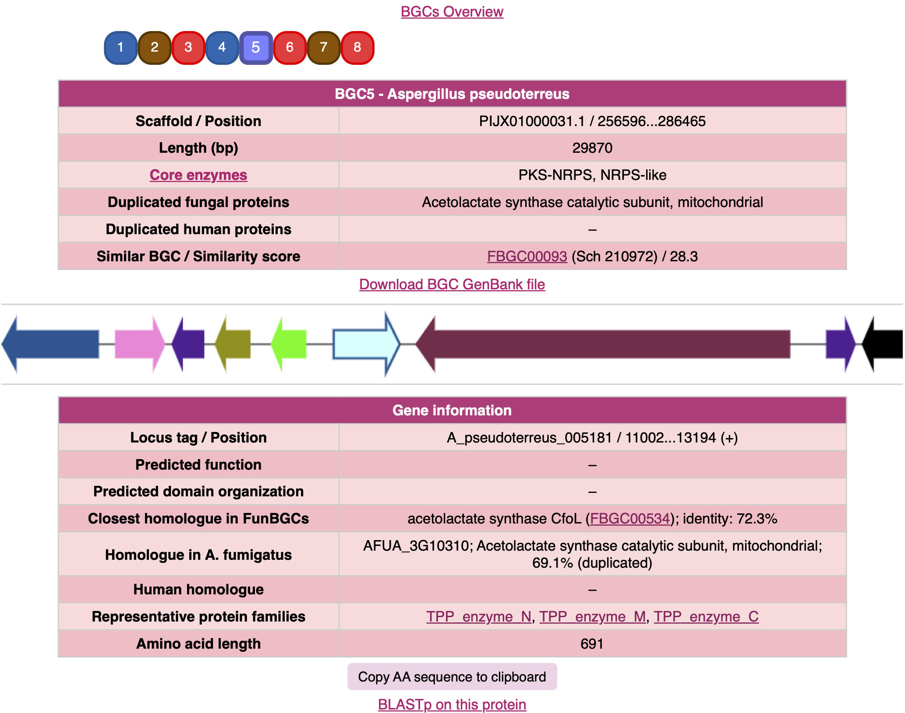

# FunBGCeX (Fungal Biosynthetic Gene Cluster eXtractor)

[](https://pypi.python.org/pypi/funbgcex)
[](https://github.com/ydmatsd/funbgcex)
[](https://zenodo.org/badge/latestdoi/661527897)

## Overview
**FunBGCeX** is a genome mining tool for fungal natural product discovery. It detects biosynthetic proteins based on our manually curated database of fungal natural product biosynthetic gene clusters (BGCs), [FunBGCs](http://staffweb1.cityu.edu.hk/ymatsuda/funbgcs/funbgcs.html). FunBGCeX can detect all possible BGCs from given fungal genomes and selectively extract BGCs according to the user's various needs. Currently available methods include:
* Extraction of BGCs encoding a homologue of a protein of the user's interest
* Extraction of BGCs harboring a putative self-resistance gene
* Extraction of BGCs lacking well-defined core biosynthetic enzyme genes (e.g., PKSs, NRPSs, and terpene synthases) — still under development
  
The extracted BGCs are provided in the GenBank format and can also be visualized using a web browser (You can access a sample output [here](docs/sample_output) or [here](http://staffweb1.cityu.edu.hk/ymatsuda/funbgcex/sample2/results.html)).

If you have difficulties installing the software, you could also try the [Google Colab version](https://colab.research.google.com/github/ydmatsd/funbgcex-colab/blob/main/funbgcex-colab/FunBGCeX.ipynb).




## Dependencies
Install the following dependencies:
* Python (version 3.8 or higher)
* [DIAMOND](https://github.com/bbuchfink/diamond/wiki/2.-Installation) (version 2.1.13 tested; older versions might cause database incompatibility)
* [HMMER](http://hmmer.org/documentation.html) (version 3.4 tested)

Make sure that `diamond` and HMMER executables (e.g., `hmmscan` and `hmmfetch`) are on your system $PATH.  
**Note:** FunBGCeX was tested on macOS Sequoia 15.6 and Red Hat Enterprise Linux 8.5 (Ootpa).

## Installation
`funbgcex` can be installed using pip:

```bash
$ pip install funbgcex
```

or by cloning the repository and installing:

```bash
$ git clone https://github.com/ydmatsd/funbgcex.git
$ cd funbgcex/
$ pip install .
```

## Usage
BGC extraction using `funbgcex` can be performed as follows:

```bash
$ funbgcex input_directory output_directory [options]
```

The `input_directory` is the path to a directory that contains GenBank files from which BGCs will be extracted. The GenBank files must include CDS features with a translation qualifier. Please ensure that no non-GenBank files are placed in this directory. The `output_directory` is the path to a directory where the results will be saved. After extraction, the output directory will contain the following:
* The `all_clusters` directory, which contains all extracted BGCs;
* The `results` directory, which contains separate results for each GenBank file;
* A CSV file named `allBGCs.csv`, which holds information about each extracted BGC;
* An HTML file named `allBGCs.html`, which summarizes all extracted BGCs and provides links to each BGC.

### Extract all possible BGCs
To extract all possible BGCs from given fungal genomes, simply run the command without any additional options as follows:

```bash
$ funbgcex input_directory output_directory
```

### Extract BGCs that encode a homologue of given protein sequence(s)
To extract BGCs that encode a homologue of protein(s) of your interest, use the target mode by specifying `-m target`. First, create a FASTA file containing the protein sequences, then run the following command:

```bash
$ funbgcex input_directory output_directory -m target -f FASTA_file
```
* `-f FASTA_file`: FASTA file containing your query protein sequences

### Extract BGCs that encode a protein with a selected protein family
To extract BGCs that encode a protein with a protein family/domain (Pfam) of your interest, use the pfam mode by specifying `-m pfam`:

```bash
$ funbgcex input_directory output_directory -m pfam -p Pfam_name
```
* `-p Pfam_name`: The Pfam domain name to be used for BGC extraction. See [here](docs/available_Pfam.txt) for the list of supported Pfam domains.

### Extract BGCs with a putative self-resistance gene
To extract BGCs that encode a possible self-resistance protein, use the sre mode by specifying `-m sre`:

```bash
$ funbgcex input_directory output_directory -m sre
```

Similar analysis can be performed using the database of disease-related human proteins. In this case, use the human mode by specifying `-m human`:

```bash
$ funbgcex input_directory output_directory -m human
```

### Extract BGCs lacking well-defined core biosynthetic enzyme genes
If you wish to extract BGCs that do not encode well-defined core enzymes (e.g., PKSs, NRPSs, and terpene synthases), specify `--no_core` when running an analysis. Note that this option can currently be used only with the target or pfam mode, so run one of the following:

```bash
$ funbgcex input_directory output_directory -m target -f FASTA_file --no_core
```

```bash
$ funbgcex input_directory output_directory -m pfam -p Pfam_name --no_core
```

### Example: Extracting BGCs encoding Pyr4-family terpene cyclases
Suppose you have several GenBank files in a directory named `gbk` in your current directory. To extract BGCs encoding a Pyr4-family terpene cyclase and save results in a directory named `results`, run:

```bash
$ funbgcex gbk results -m pfam -p Pyr4
```

Alternatively, if you have a FASTA file named `Pyr4.fasta` (an example FASTA file can be found [here](docs/Pyr4.fasta)) containing Pyr4 homologues saved in your current directory, run:

```bash
$ funbgcex gbk results -m target -f Pyr4.fasta
```

### Other options
To check other options, run the following:

```bash
$ funbgcex --help
```

## Citation
If you find FunBGCeX useful, please cite:  
Tang, J., Matsuda, Y. *Nat. Commun.* **15**, 4312 (2024)
