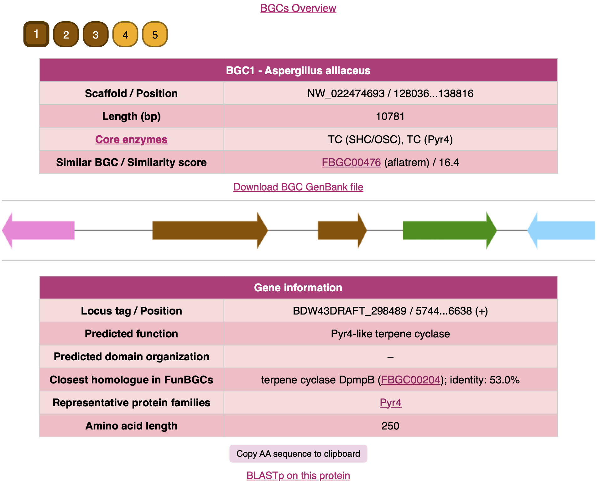

# FunBGCeX (Fungal Biosynthetic Gene Cluster eXtractor)

[](https://pypi.python.org/pypi/funbgcex)
[](https://github.com/ydmatsd/funbgcex)
[](https://zenodo.org/badge/latestdoi/661527897)

## Overview
**FunBGCeX** is a genome mining tool for fungal natural product discovery, which detects biosynthetic proteins based on our manually curated database of fungal natural product biosynthetic gene clusters (BGCs), [FunBGCs](http://staffweb1.cityu.edu.hk/ymatsuda/funbgcs/funbgcs.html). FunBGCeX can extract not only all possible BGCs from given fungal genomes but also those encoding a protein of user's interest. The extracted BGCs are provided in the GenBank format and can also be visualized using a web browser (You can access a sample output [here](docs/sample_output) or [here](http://staffweb1.cityu.edu.hk/ymatsuda/funbgcex/sample/results.html)).



## Dependencies
Install the following dependencies:
* Python (version 3.8 or higher)
* [DIAMOND](https://github.com/bbuchfink/diamond/wiki/2.-Installation) (version 2.1.7 tested; older versions might cause database incompatibility)
* [HMMER](http://hmmer.org/documentation.html) (version 3.3.2 tested)

Make sure that `diamond` and HMMER executables (e.g., `hmmscan` and `hmmfetch`) are on your system $PATH.  
**Note:** FunBGCeX was tested on MacOS Ventura 13.4.

## Installation
`funbgcex` can be installed using pip:

```bash
$ pip install funbgcex
```

or by cloning the repository and installing:

```bash
$ git clone https://github.com/ydmatsd/funbgcex.git
$ cd funbgcex/
$ pip install .
```

## Usage
BGC extraction using `funbgcex` can be performed as follows:

```bash
$ funbgcex input_directory output_directory [options]
```

The `input_directory` is the path to a directory that contains GenBank files from which BGCs will be extracted. The GenBank files need to have CDS features with a translation qualifier. Do not include any non-GenBank files in the directory.  
The `output_directory` is the path to a directory in which the results will be saved.

After the BGC extraction, the output directory should have the `all_clusters` and `results` directories and the CSV file named `allBGCs.csv`. The `all_clusters` directory contains all the extracted BGCs, while the `results` directory has separate results from each GenBank file. The CSV file `allBGCs.csv` contains the information of each extracted BGC.

### Extract all possible BGCs
To extract all possible BGCs from given fungal genomes, simply run without options as follows:

```bash
$ funbgcex input_directory output_directory
```

### Extract BGCs that encode a homologue of given protein sequence(s)
To extract BGCs that encode a homologue of protein(s) of your interest, use the target mode by specifying `-m target`. First, create a FASTA file containing the protein sequences, and then run the following:

```bash
$ funbgcex input_directory output_directory -m target -f FASTA_file
```

### Extract BGCs that encode a protein with a selected protein family
To extract BGCs that encode a protein with a protein family/domain (Pfam) of your interest, use the pfam mode by specifying `-m pfam`:

```bash
$ funbgcex input_directory output_directory -m pfam -p Pfam_name
```

See [here](docs/available_Pfam.txt) for available protein domains.

### Example: Extracting BGCs encoding Pyr4-family terpene cyclases
Suppose you have several GenBank files in a directory named `gbk` in your current directory. If you wish to extract BGCs that encode a Pyr4-family terpene cyclase from these GenBank files and to obtain the result in a directory named `results`, then run the following:

```bash
$ funbgcex gbk results -m pfam -p Pyr4
```

Alternatively, you may prepare a FASTA file containing the protein sequences of Pyr4 homologues. If the FASTA file is saved as `Pyr4.fasta` (an example FASTA file can be found [here](docs/Pyr4.fasta)) in your current directory, then run the following:

```bash
$ funbgcex gbk results -m target -f Pyr4.fasta
```

### Other options
To check other options, run the following:

```bash
$ funbgcex --help
```

## Citation
If you find FunBGCeX useful, please cite:  
Tang, J., Matsuda, Y. *Nat. Commun.* **15**, 4312 (2024)
